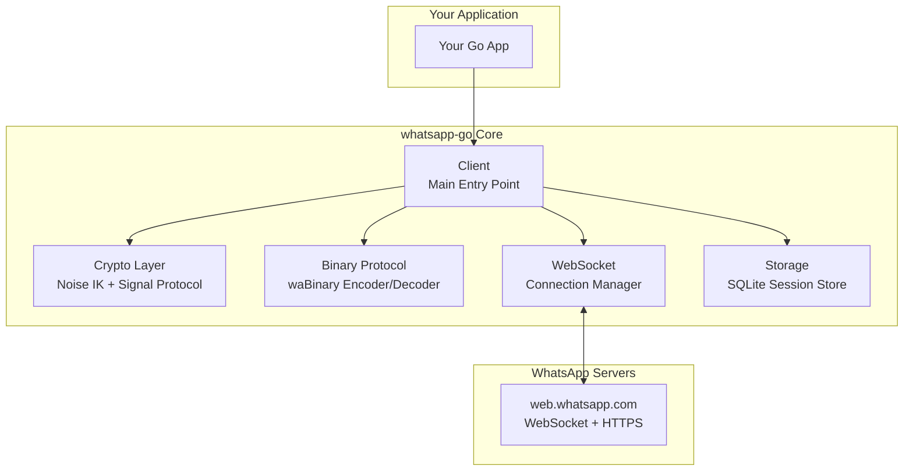
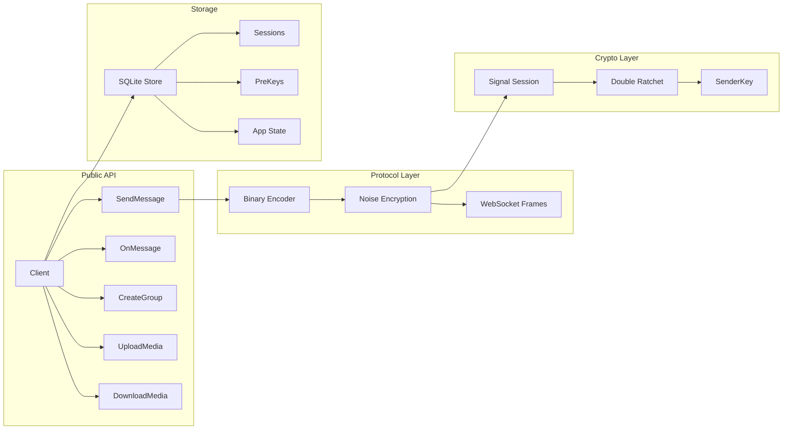
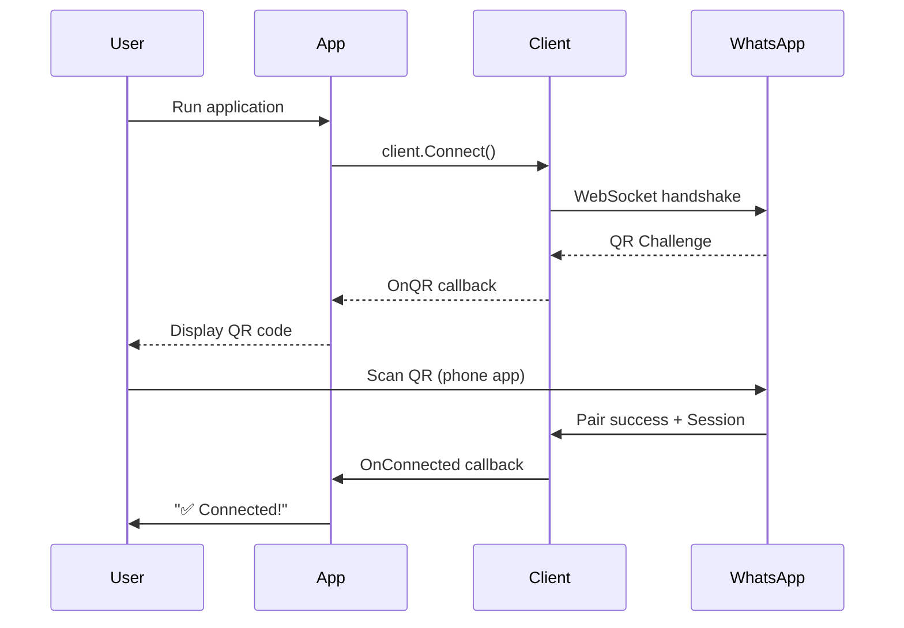

# 🚀 WhatsApp-Go

> **A from-scratch Go implementation of the WhatsApp Web Multidevice Protocol**
>
> Built with ❤️ by [Soumen-Developer](https://github.com/Soumen-Developer) — Clean architecture, zero dependencies on unofficial forks, fully documented.

---

## 🎯 What is this?

A **production-ready WhatsApp client library** written entirely in Go that implements the WhatsApp Web Multidevice protocol from the ground up. No reverse-engineered forks, no hidden dependencies — just clean, auditable Go code.



---

## ✨ Features

| Category | Status | Details |
|----------|--------|---------|
| 🔐 **Noise IK Handshake** | ✅ Done | Full Noise_IK_25519_ChaChaPoly_SHA256 implementation |
| 🔑 **Signal Protocol** | ✅ Done | X3DH + Double Ratchet + SenderKey (groups) |
| 📦 **Binary Protocol** | ✅ Done | waBinary encoder/decoder with token dictionary |
| 🌐 **WebSocket** | ✅ Done | Custom framing, auto-reconnect, keepalive |
| 💾 **Session Storage** | ✅ Done | SQLite with atomic writes |
| 📱 **Pairing** | ✅ Done | QR Code + Passkey (WebAuthn) |
| 💬 **Messaging** | ✅ Done | Text, Image, Video, Audio, Document, Sticker, Location, Contact, Poll |
| 📥 **Media** | ✅ Done | Upload/Download with AES-CBC + HMAC |
| 👥 **Groups** | ✅ Done | Create, participants, admins, communities, invites |
| ⚙️ **App State Sync** | ✅ Done | Contacts, settings, privacy, blocklist, LTHash |
| 📰 **Newsletters** | 🚧 Planned | Subscribe, messages, reactions |
| 📞 **Calls** | 🚧 Planned | Signaling support |

---

## 🏗️ Architecture



---

## 📦 Installation

```bash
go get github.com/Soumen-Developer/whatsapp-go
```

Requires Go 1.25+

---

## 🚀 Quick Start

```go
package main

import (
    "context"
    "fmt"
    "log"
    "os"
    "os/signal"
    "syscall"

    "github.com/Soumen-Developer/whatsapp-go"
    "github.com/Soumen-Developer/whatsapp-go/store/sqlstore"
)

func main() {
    // 1. Initialize storage
    ctx := context.Background()
    container, err := sqlstore.New(ctx, "sqlite3", "file:whatsapp.db?_foreign_keys=on", nil)
    if err != nil {
        log.Fatal(err)
    }
    device, err := container.GetFirstDevice(ctx)
    if err != nil {
        log.Fatal(err)
    }

    // 2. Create client
    client := whatsapp.NewClient(device, nil)

    // 3. Handle incoming messages
    client.OnMessage(func(msg *whatsapp.Message) {
        fmt.Printf("📨 From %s: %s\n", msg.From, msg.Text)
        
        // Auto-reply demo
        if msg.Text == "ping" {
            client.SendText(msg.From, "pong! 🏓")
        }
    })

    // 4. Handle QR code for pairing
    client.OnQR(func(qr string) {
        fmt.Println("📱 Scan this QR code with WhatsApp on your phone:")
        fmt.Println(qr)
    })

    // 5. Connect
    if err := client.Connect(); err != nil {
        log.Fatal(err)
    }
    defer client.Disconnect()

    fmt.Println("✅ Connected! Press Ctrl+C to exit.")
    
    // 6. Wait for interrupt
    sigChan := make(chan os.Signal, 1)
    signal.Notify(sigChan, syscall.SIGINT, syscall.SIGTERM)
    <-sigChan
}
```

---

## 📸 How Pairing Works



---

## 🛠️ API Reference

### Client

```go
// Create new client
client := whatsapp.NewClient(deviceStore, logger)

// Connection
client.Connect() error
client.Disconnect() error
client.IsConnected() bool

// Messaging
client.SendText(to, text string) error
client.SendImage(to string, data []byte, caption string) error
client.SendVideo(to string, data []byte, caption string) error
client.SendAudio(to string, data []byte, ptt bool) error  // ptt=true = voice note
client.SendDocument(to string, data []byte, filename, mimetype string) error
client.SendLocation(to string, lat, lng float64, name, address string) error
client.SendContact(to string, contacts []Contact) error
client.SendPoll(to string, question string, options []string) error

// Media
client.UploadMedia(ctx, data []byte, mediaType MediaType) (MediaHandle, error)
client.DownloadMedia(ctx, handle MediaHandle) ([]byte, error)

// Groups
client.CreateGroup(name string, participants []string) (string, error)
client.AddParticipants(groupJID string, participants []string) error
client.RemoveParticipants(groupJID string, participants []string) error
client.PromoteParticipants(groupJID string, participants []string) error
client.DemoteParticipants(groupJID string, participants []string) error
client.GetGroupInfo(groupJID string) (*GroupInfo, error)
client.SetGroupTopic(groupJID, topic string) error
client.SetGroupPicture(groupJID string, data []byte) error

// Events
client.OnMessage(fn func(*Message))
client.OnQR(fn func(string))
client.OnConnected(fn func())
client.OnDisconnected(fn func(error))
client.OnReceipt(fn func(*Receipt))
client.OnPresence(fn func(*Presence))
client.OnTyping(fn func(*Typing))
```

### Message Types

```go
type Message struct {
    ID        string
    From      JID
    To        JID
    Timestamp time.Time
    Type      MessageType
    Text      string
    Image     *ImageMessage
    Video     *VideoMessage
    Audio     *AudioMessage
    Document  *DocumentMessage
    Sticker   *StickerMessage
    Location  *LocationMessage
    Contact   *ContactMessage
    Poll      *PollMessage
    Reaction  *ReactionMessage
    Edit      *EditedMessage
    Revoke    *RevokedMessage
}
```

---

## 🔧 Configuration

```go
type Config struct {
    // Database
    DBPath string // default: "whatsapp.db"
    
    // Logging
    LogLevel string // "debug", "info", "warn", "error"
    
    // Network
    ProxyURL string // optional HTTP/SOCKS5 proxy
    
    // Behavior
    AutoReconnect     bool // default: true
    MaxRetries        int  // default: 5
    RetryBackoff      time.Duration
    
    // Media
    MaxMediaSize      int64 // default: 100MB
    MediaCacheDir     string
    
    // Privacy
    PasskeyEnabled    bool // default: true
    PasskeyDomain     string // default: "web.whatsapp.com"
}
```

---

## 📁 Project Structure

```
whatsapp-go/
├── go.mod
├── go.sum
├── LICENSE
├── README.md
├── CHANGELOG.md
├── Makefile
├── .golangci.yml
├── .github/
│   └── workflows/
│       ├── test.yml
│       └── release.yml
├── client.go                 # Main client
├── config.go                 # Configuration
├── events.go                 # Event definitions
├── crypto/
│   ├── keys.go               # Curve25519, Ed25519, HKDF
│   ├── message.go            # Message encryption
│   ├── media.go              # Media key derivation
│   └── noise/
│       ├── handshake.go      # Noise IK state machine
│       ├── cipherstate.go    # ChaChaPoly
│       ├── symmetricstate.go # HKDF chaining
│       └── prologue.go       # WhatsApp prologue
├── binary/
│   ├── node.go               # Node structure
│   ├── encoder.go            # Binary encoder
│   ├── decoder.go            # Binary decoder
│   ├── tokens.go             # Token dictionary
│   └── reader.go             # Streaming reader
├── socket/
│   ├── websocket.go          # WebSocket dialer
│   ├── frames.go             # Frame protocol
│   ├── connection.go         # Connection lifecycle
│   └── keepalive.go          # Ping/pong
├── signal/
│   ├── x3dh.go               # X3DH key agreement
│   ├── ratchet.go            # Double ratchet
│   ├── session.go            # Session state
│   ├── prekey.go             # PreKey management
│   ├── senderkey.go          # Group sender keys
│   └── store/
│       ├── interface.go
│       └── sqlite.go
├── pairing/
│   ├── qr.go                 # QR pairing
│   ├── passkey.go            # WebAuthn passkey
│   └── registration.go       # Device registration
├── send.go                   # SendMessage implementation
├── receive.go                # Incoming message handling
├── upload.go                 # Media upload
├── download.go               # Media download
├── group/
│   ├── create.go
│   ├── participants.go
│   ├── info.go
│   ├── invite.go
│   └── community.go
├── appstate/
│   ├── lthash.go
│   ├── processor.go
│   ├── contacts.go
│   ├── settings.go
│   └── blocklist.go
├── store/
│   ├── sqlstore/
│   │   ├── container.go
│   │   ├── device.go
│   │   ├── session.go
│   │   ├── prekey.go
│   │   ├── senderkey.go
│   │   └── appstate.go
│   └── interface.go
├── types/
│   ├── jid.go
│   ├── message.go
│   ├── group.go
│   ├── media.go
│   └── events.go
└── examples/
    ├── basic-bot/
    │   └── main.go
    ├── media-bot/
    │   └── main.go
    └── group-manager/
        └── main.go
```

---

## 🧪 Testing

```bash
# Run all tests
make test

# Run with coverage
make test-coverage

# Run specific package
go test ./crypto/noise/... -v

# Run integration tests (requires paired device)
make test-integration
```

---

## 📊 Benchmarks

```bash
make bench
```

| Operation | ns/op | MB/s |
|-----------|-------|------|
| Binary Encode | ~2,500 | ~400 |
| Binary Decode | ~3,200 | ~310 |
| Noise Handshake | ~15,000 | - |
| Signal Encrypt | ~8,500 | ~120 |
| Signal Decrypt | ~9,200 | ~110 |

---

## 🤝 Contributing

1. Fork the repository
2. Create feature branch (`git checkout -b feature/amazing-feature`)
3. Commit changes (`git commit -m 'Add amazing feature'`)
4. Push to branch (`git push origin feature/amazing-feature`)
5. Open a Pull Request

### Code Style

- Run `make lint` before committing
- Follow Go standard formatting (`gofmt`)
- Write tests for new features
- Update documentation

---

## 📄 License

**MPL-2.0** — See [LICENSE](LICENSE) for details.

```
Copyright (c) 2024 Soumen-Developer
```

---

## ⚠️ Disclaimer

This library implements the WhatsApp Web Multidevice protocol for educational and personal automation purposes. 

- **Not affiliated** with WhatsApp, Meta, or any official entity
- **Use responsibly** — respect WhatsApp's Terms of Service
- **Risk of account restrictions** exists with unofficial clients
- **Not for spam/bulk messaging** — will get you banned

---

## 🙏 Acknowledgments

- [WhatsApp Web Protocol](https://github.com/tulir/whatsmeow) - Reference implementation
- [Noise Protocol Framework](https://noiseprotocol.org/) - Noise IK specification
- [Signal Protocol](https://signal.org/docs/) - Double Ratchet specification
- [Go](https://golang.org/) - The language that makes this possible

---

## 📞 Support

- 🐛 **Issues**: [GitHub Issues](https://github.com/Soumen-Developer/whatsapp-go/issues)
- 💬 **Discussions**: [GitHub Discussions](https://github.com/Soumen-Developer/whatsapp-go/discussions)
- 📧 **Email**: soumen@devloper.dev

---

<div align="center">

**Made with Go and ☕ by Soumen-Developer**

[](https://golang.org/)
[](LICENSE)
[](https://github.com/Soumen-Developer/whatsapp-go/actions)
[](https://codecov.io/gh/Soumen-Developer/whatsapp-go)
[](https://pkg.go.dev/github.com/Soumen-Developer/whatsapp-go)
[](https://github.com/Soumen-Developer/whatsapp-go/stargazers)

</div>